# RetailEdge Pro - End-to-End Workflow Architecture

## Overview: Request → Frontend → Backend → Database → External Services → Response

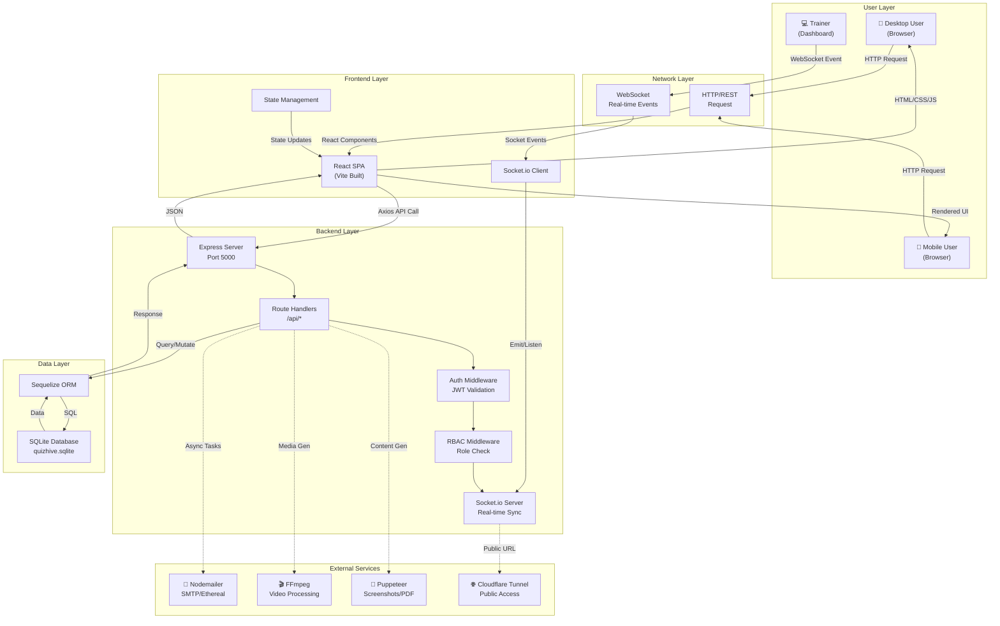

---

## 1. Authentication & Authorization Workflow

### Login Flow

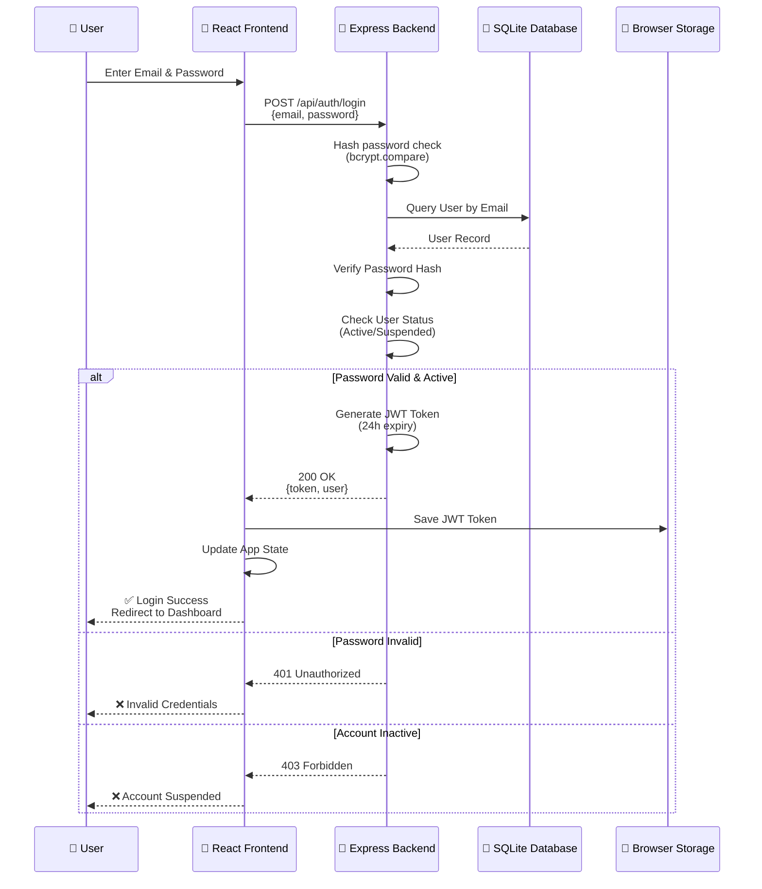

### Authenticated Request Flow

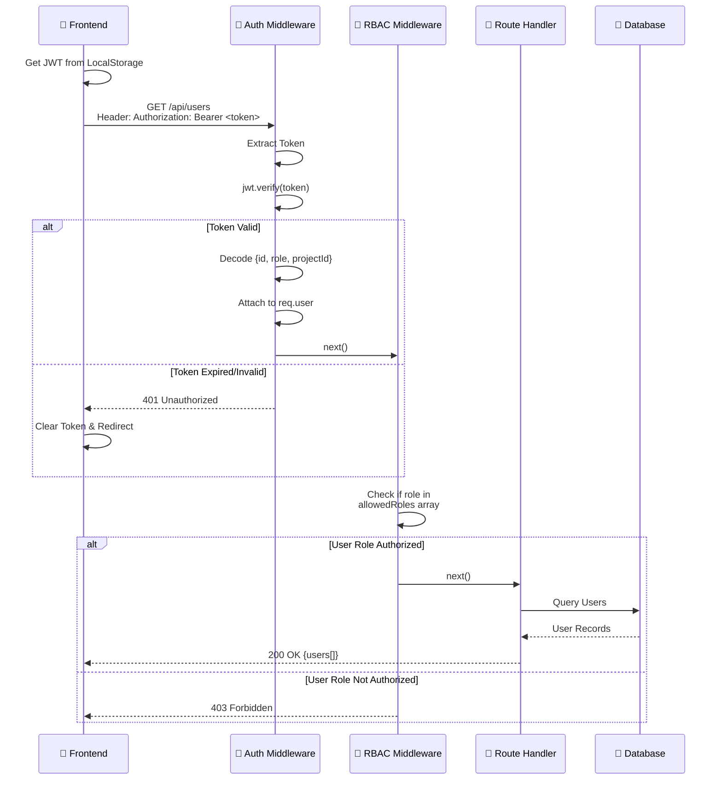

---

## 2. Quiz Session Workflow (Real-Time)

### Quiz Trainer Initiates Live Session

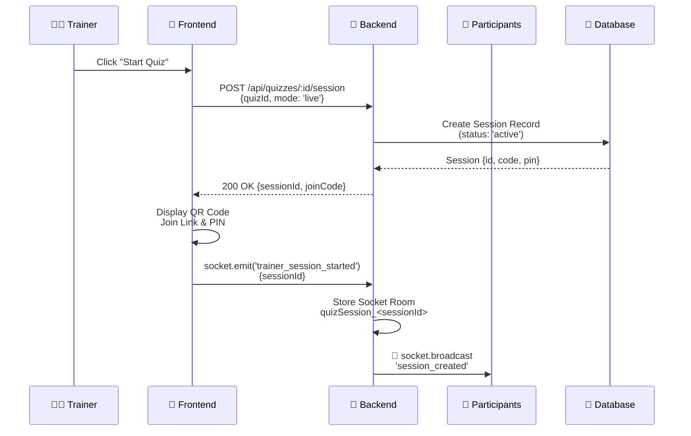

### Participant Joins Quiz Session

```mermaid
sequenceDiagram
    participant Participant as 📱 Participant
    participant Phone as 🎨 Phone Frontend
    participant Backend as 🔌 Backend
    participant Trainer as 👨‍🏫 Trainer
    participant TrainerUI as 🎨 Trainer UI
    participant DB as 💾 Database

    Participant->>Phone: Scan QR Code or Enter Code
    Phone->>Backend: GET /api/quizzes/:id/offline-details<br/>?code=ABC123
    Backend->>DB: Lookup Session by Code
    DB-->>Backend: Session Details & Quiz
    Backend-->>Phone: 200 OK {quiz, questions, sessionId}
    
    Phone->>Phone: Display "Ready to Join?"
    Participant->>Phone: Enter Name & Employee ID
    Phone->>Backend: POST /api/quizzes/:id/offline-check-eligibility<br/>{sessionId, participantInfo}
    
    Backend->>DB: Check Participant Eligibility<br/>(Project, Previous Attempts, Time Window)
    alt Eligible
        Backend->>DB: Create Participant Record<br/>(status: 'joined', score: null)
        DB-->>Backend: Participant {id, sessionId}
        Backend-->>Phone: 200 OK {participantId}
        
        Phone->>Backend: socket.emit('participant_joined')<br/>{participantId, name}
        Backend->>Backend: Add Socket to Room
        Backend->>Backend: Store Participant Session Mapping
        Backend-->>TrainerUI: 📡 Participant Connected<br/>(Live Update)
        TrainerUI->>Trainer: ✅ "<name> has joined"
    else Not Eligible
        Backend-->>Phone: 403 Forbidden {reason}
        Phone->>Participant: ❌ Cannot Join
    end
```

### Quiz Question Display & Response Flow

```mermaid
sequenceDiagram
    participant Trainer as 👨‍🏫 Trainer
    participant TrainerUI as 🎨 Trainer UI
    participant Backend as 🔌 Backend
    participant Participant as 📱 Participant
    participant Phone as 📱 Phone

    Trainer->>TrainerUI: Click "Next Question"
    TrainerUI->>Backend: socket.emit('post_question')<br/>{sessionId, questionNumber}
    
    Backend->>DB: Fetch Question Details
    DB-->>Backend: Question {id, text, type, options}
    Backend->>Backend: Start Timer (if timed)
    Backend->>Participant: 📡 socket.broadcast('question_posted')<br/>{question, timeLimit}
    
    Phone->>Phone: Display Question & Options
    Participant->>Phone: Select Answer(s)
    
    Phone->>Backend: socket.emit('participant_response')<br/>{participantId, questionId, answer, timeSpent}
    Backend->>Backend: Validate Response Format
    Backend->>DB: Store Response Record<br/>{participantId, questionId, answer, timestamp}
    
    Backend->>Backend: Calculate Correctness<br/>(if MCQ type)
    Backend->>Backend: Check if Answer Correct<br/>(compare with correct_answer)
    
    Backend->>DB: Update Participant Score<br/>(if correct: +points)
    Backend-->>TrainerUI: 📡 Participant Responded
    TrainerUI->>Trainer: ✅ Answer Submitted

    opt Timer Expired & No Response
        Backend->>Backend: Timeout Handler
        Backend->>DB: Mark as Unanswered
    end
```

### Quiz Session End & Results

```mermaid
sequenceDiagram
    participant Trainer as 👨‍🏫 Trainer
    participant TrainerUI as 🎨 Trainer UI
    participant Backend as 🔌 Backend
    participant Participant as 📱 Participant
    participant Phone as 📱 Phone
    participant DB as 💾 Database

    Trainer->>TrainerUI: Click "End Quiz"
    TrainerUI->>Backend: socket.emit('end_session')<br/>{sessionId}
    
    Backend->>DB: Get All Responses<br/>for sessionId
    DB-->>Backend: Responses[]
    
    Backend->>Backend: Calculate Final Scores<br/>for Each Participant<br/>(total correct/score)
    Backend->>Backend: Rank Participants<br/>(leaderboard)
    Backend->>DB: Update Session<br/>(status: 'completed')<br/>Update Participants<br/>(final_score, rank)
    
    Backend->>Backend: Generate Results Object<br/>{scores, ranks, pass/fail}
    Backend-->>TrainerUI: 📡 'session_ended'<br/>{results, leaderboard}
    Backend-->>Phone: 📡 'session_ended'<br/>{yourScore, rank, result}
    
    TrainerUI->>Trainer: ✅ Session Ended<br/>Display Results
    Phone->>Participant: ✅ Quiz Complete<br/>Your Score: X/Y
    
    Trainer->>TrainerUI: Click "Download Report"
    TrainerUI->>Backend: GET /api/reports/:sessionId
    Backend->>DB: Query Session + All Responses
    Backend->>Backend: Aggregate Data
    Backend->>Backend: Generate PDF (Puppeteer)
    Backend-->>TrainerUI: PDF File
    TrainerUI->>Trainer: ✅ Report Downloaded
```

---

## 3. Training & Certification Workflow

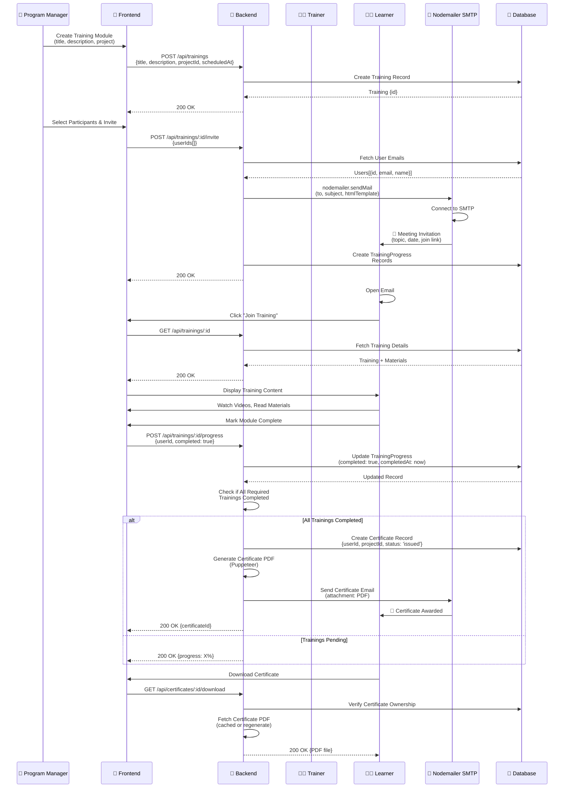

---

## 4. Offline Quiz Workflow (Mobile Sync)

### Download for Offline Use

```mermaid
sequenceDiagram
    participant Participant as 📱 Participant
    participant Phone as 🎨 Phone Browser
    participant Backend as 🔌 Backend
    participant DB as 💾 Database
    participant BrowserStorage as 💾 IndexedDB

    Participant->>Phone: Navigate to Offline Quiz
    Phone->>Backend: GET /api/quizzes/:id/offline-details
    Backend->>DB: Fetch Quiz + Questions
    DB-->>Backend: Complete Quiz Object
    Backend-->>Phone: 200 OK {quiz, questions[], options}
    
    Phone->>BrowserStorage: Store Quiz Data<br/>(IndexedDB)
    Phone->>Participant: ✅ Quiz Ready<br/>Offline Available

    Participant->>Phone: (No Internet)<br/>Open Offline Quiz
    Phone->>BrowserStorage: Retrieve Quiz Data
    BrowserStorage-->>Phone: Quiz Data
    Phone->>Participant: Display Questions
    Participant->>Phone: Answer Questions
    Phone->>BrowserStorage: Save Responses<br/>(as you go)
```

### Upload Responses When Online

```mermaid
sequenceDiagram
    participant Phone as 📱 Phone
    participant BrowserStorage as 💾 IndexedDB
    participant NetworkDetector as 🌐 Network Detector
    participant Backend as 🔌 Backend
    participant DB as 💾 Database

    Phone->>NetworkDetector: Listen for Network Events
    NetworkDetector->>NetworkDetector: Detect Online Status
    
    opt User Goes Online
        NetworkDetector->>Phone: Network Available
        Phone->>BrowserStorage: Retrieve Unsync Responses
        BrowserStorage-->>Phone: Responses[]
        
        Phone->>Backend: POST /api/quizzes/:id/offline-submit<br/>{participantId, responses[]}<br/>{offline: true, timestamp, deviceInfo}
        
        Backend->>DB: Verify Participant Eligibility
        Backend->>DB: Check Timestamps<br/>(prevent tampering)
        Backend->>Backend: Validate Responses
        Backend->>DB: Batch Insert Responses<br/>via OfflineSyncDevice Record
        
        DB-->>Backend: Inserted
        Backend-->>Phone: 200 OK {syncId, status: 'synced'}
        
        Phone->>BrowserStorage: Clear Synced Responses
        Phone->>Participant: ✅ Responses Synced
    end
```

---

## 5. Report Generation Workflow

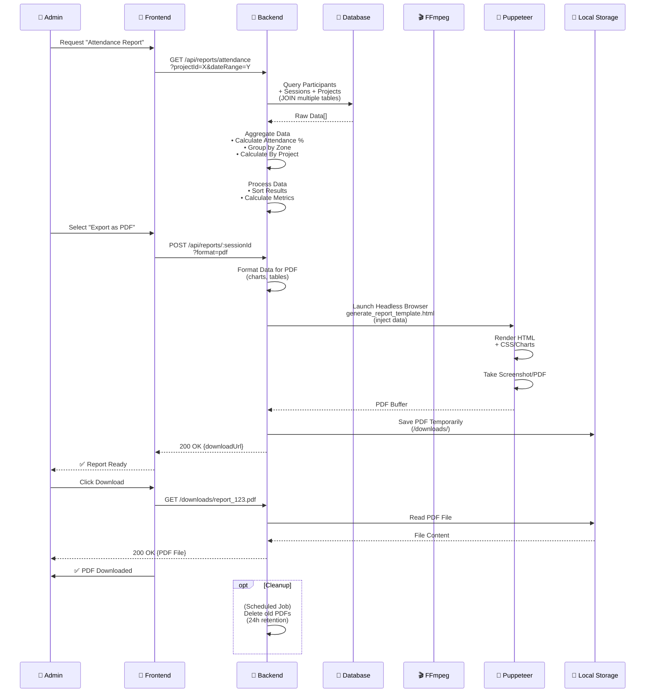

### Excel Export Workflow

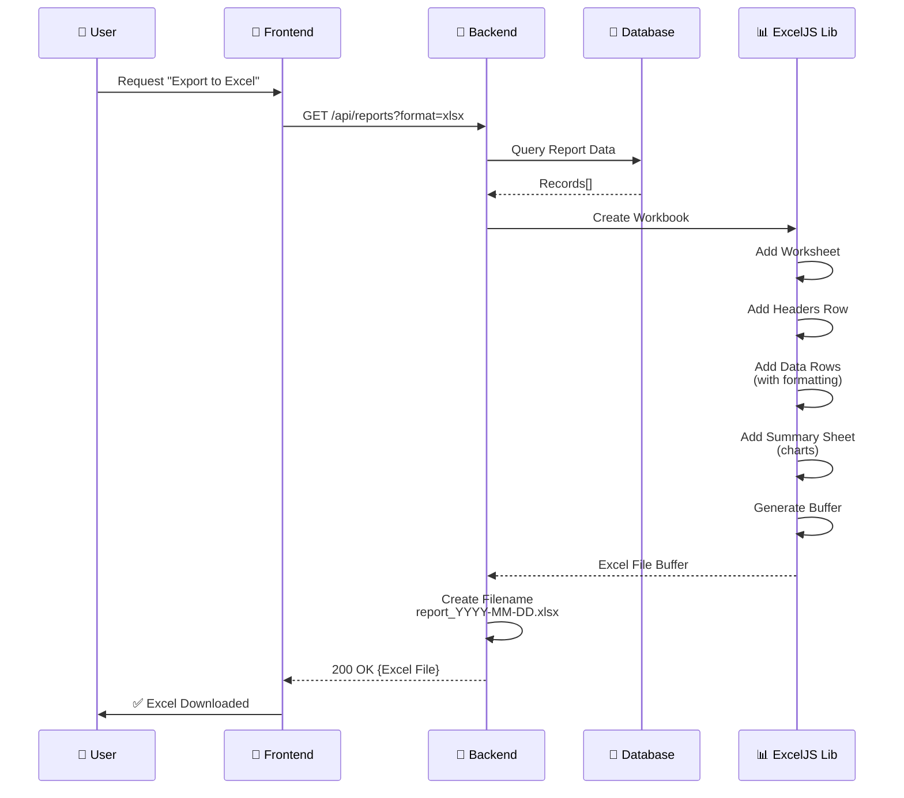

---

## 6. File Upload & Processing Workflow

### User Profile Picture Upload

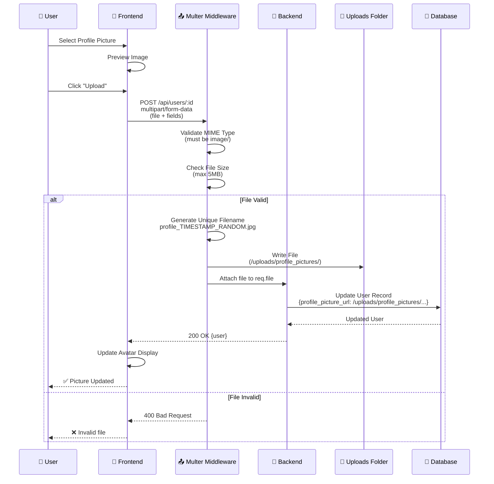

### Project Logo Upload

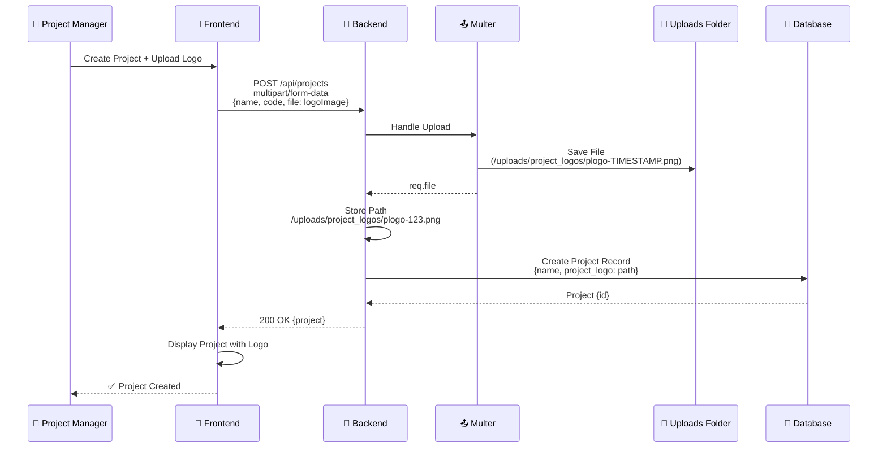

---

## 7. Real-Time Communication (WebSocket) Workflow

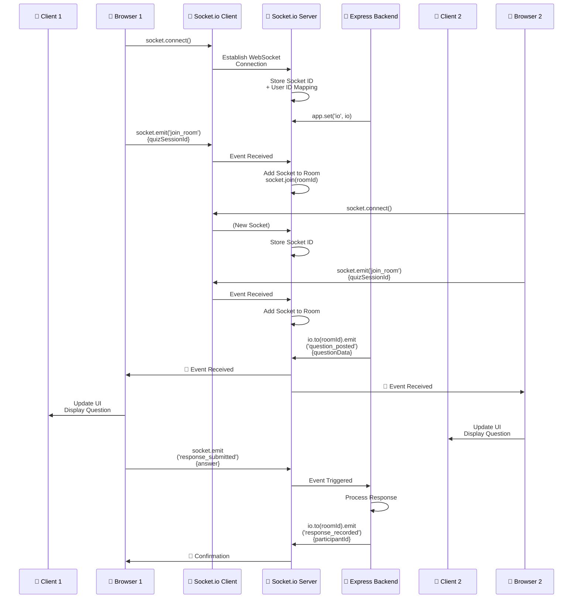

---

## 8. End-to-End Data Flow Example: Quiz Taking

### Complete Sequence

```
┌─────────────────────────────────────────────────────────────────────┐
│ QUIZ PARTICIPANT JOURNEY: From QR Scan to Certificate               │
└─────────────────────────────────────────────────────────────────────┘

STEP 1: DISCOVERY
───────────────────
User (Participant) receives SMS/Email with QR code
                          ↓
Scans QR → Browser opens → Frontend loads React SPA (5173 dev / 5000 prod)


STEP 2: QUIZ LOOKUP & ELIGIBILITY CHECK
──────────────────────────────────────────
Frontend: GET /api/quizzes/:id/offline-details?code=ABC123
                          ↓
Backend: Extract quiz ID from code
                          ↓
Backend Auth Middleware: No auth required (public endpoint)
                          ↓
Backend Route Handler: queries DB for Quiz + Questions
                          ↓
DB: SELECT quiz, questions, options FROM database
                          ↓
Response: {quiz, questions[], options} → Frontend
                          ↓
Frontend: Display "Ready to Join? Enter Name"


STEP 3: SESSION ENTRY
──────────────────────
User: Types Name + Employee ID
                          ↓
Frontend: POST /api/quizzes/:id/offline-check-eligibility
          {name, employeeId, sessionCode}
                          ↓
Backend: Validate participant eligibility
         • Is project active?
         • Has user already attempted? (check max_attempts)
         • Is participant within allowed time window?
                          ↓
DB: SELECT user, project, previous_responses
                          ↓
Backend Logic: 
  if (eligible) {
    DB: INSERT INTO participants {name, sessionId, score: null}
    response: {participantId, status: 'joined'}
  } else {
    response: {error: 'Not eligible', reason: '...'} 
  }
                          ↓
Frontend: If error → Show "You cannot join this quiz"
          If success → Socket.io connect


STEP 4: REAL-TIME CONNECTION
──────────────────────────────
Frontend: socket.connect(backend_url)
          socket.emit('participant_joined', {participantId, name})
                          ↓
Backend Socket.io Server: Receives event
                          ↓
Backend: socket.join('quiz_session_' + sessionId)
         Store mapping: socketId ↔ participantId
                          ↓
Backend: Emit to Trainer: 'participant_joined', {name}
         (Trainer UI updates: "John has joined")
                          ↓
Frontend: Display "Waiting for first question..."


STEP 5: QUESTION & RESPONSE CYCLE
──────────────────────────────────
[Trainer clicks "Next Question"]
                          ↓
Trainer Frontend: socket.emit('post_question', {questionId, timeLimit})
                          ↓
Backend Socket Server: Receives from trainer socket
                          ↓
Backend: DB.query('SELECT * FROM questions WHERE id = ?')
         Broadcast to room: io.to('quiz_session_X').emit(
           'question_posted',
           {
             id: questionId,
             text: "What is customer loyalty?",
             type: "multiple_choice",
             options: ["A", "B", "C", "D"],
             timeLimit: 30
           }
         )
                          ↓
Frontend: Receives WebSocket event
          Timer: countdown 30 seconds
          Display question + radio buttons
                          ↓
User: Clicks Option B
                          ↓
Frontend: socket.emit('participant_response', {
  participantId,
  questionId,
  answer: 'B',
  timeSpent: 5
})
                          ↓
Backend: Receives response
         
         // Validate
         const isCorrect = (answer === question.correct_answer)
         
         // Store in DB
         DB: INSERT INTO responses {participantId, questionId, answer, ...}
         
         // Update score
         if (isCorrect) {
           DB: UPDATE participants SET score = score + 10 WHERE id = participantId
         }
                          ↓
Backend: Emit to Trainer: 'response_recorded', {participantName, correct}
         Emit to Participant: 'response_accepted'


STEP 6: QUIZ END
────────────────
[After all questions]
                          ↓
Trainer: Clicks "End Quiz"
                          ↓
Trainer Frontend: socket.emit('session_ended', {sessionId})
                          ↓
Backend: DB.query('SELECT p.*, COUNT(r.id) as attempts, SUM(r.correct) as score
          FROM participants p
          LEFT JOIN responses r ON p.id = r.participantId
          WHERE p.sessionId = ? GROUP BY p.id')
                          ↓
Backend: Calculate results
         • Final Score: 8/10 = 80%
         • Pass/Fail: if (score >= 60) PASS else FAIL
         • Rank: based on scores (1st, 2nd, 3rd...)
                          ↓
Backend: DB: UPDATE session SET status = 'completed', endedAt = now()
         DB: UPDATE participants SET final_score = 80, status = 'completed'
                          ↓
Backend: Emit to all: 'session_ended', {
  yourScore: 80,
  totalScore: 100,
  rank: 2,
  result: 'PASS',
  leaderboard: [{name, score, rank}...]
}
                          ↓
Frontend: Display results screen
          "Congratulations! You scored 80/100"
          "You ranked 2nd"


STEP 7: REPORT GENERATION
──────────────────────────
Trainer: Clicks "Download Report"
                          ↓
Trainer Frontend: GET /api/reports/:sessionId?format=pdf
                          ↓
Backend: DB.query('SELECT * FROM sessions
         JOIN participants ON session.id = participants.sessionId
         JOIN responses ON participants.id = responses.participantId
         WHERE sessionId = ? ...')
                          ↓
Backend: Aggregate data:
  {
    sessionId: 123,
    quizTitle: "Customer Service Quiz",
    totalQuestions: 10,
    participants: [
      {name: "John", score: 80, rank: 1},
      {name: "Jane", score: 75, rank: 2}
    ],
    statistics: {
      avgScore: 77.5,
      passRate: 100%,
      duration: 45min
    }
  }
                          ↓
Backend: Puppeteer.launch()
         Generate HTML with data
         <html><body>
           <h1>Quiz Report: Customer Service</h1>
           <table>
             <tr><td>Participant</td><td>Score</td><td>Rank</td></tr>
             ... data rows ...
           </table>
           <canvas id="chart"></canvas>
         </body></html>
                          ↓
Puppeteer: Render HTML
           Take screenshot / PDF
           Return PDF Buffer
                          ↓
Backend: Save to /backend/downloads/report_session123.pdf
         Return download URL
                          ↓
Frontend: Trigger download
          Browser downloads: report_session123.pdf


STEP 8: CERTIFICATE (IF TRAINING COMPLETE)
──────────────────────────────────────────
[After completing all quiz/trainings for project]
                          ↓
Backend: Background job checks:
  SELECT * FROM trainingProgress
  WHERE userId = ? AND projectId = ?
  COUNT(*) = required_trainings AND all completed = TRUE
                          ↓
Backend: If eligible:
  DB: INSERT INTO certificates {
    userId,
    projectId,
    issuedAt: now(),
    status: 'issued'
  }
                          ↓
Backend: Puppeteer.launch()
         Generate certificate HTML:
         <html>
           <body style="certificate styling">
             <h1>Certificate of Completion</h1>
             <p>This is to certify that [Name]</p>
             <p>Has successfully completed [Project]</p>
             <p>Date: [Date]</p>
             
           </body>
         </html>
                          ↓
Puppeteer: Render → PDF
           Save to /uploads/certificates/cert_user123.pdf
                          ↓
Backend: nodemailer.sendMail({
  to: participant.email,
  subject: 'Certificate of Completion',
  html: emailTemplate,
  attachments: [{
    filename: 'Certificate.pdf',
    path: '/uploads/certificates/cert_user123.pdf'
  }]
})
                          ↓
SMTP Server: (Ethereal/Gmail/SendGrid)
           Deliver email to participant
                          ↓
Participant: Receives email with PDF attachment
            Downloads certificate


┌─────────────────────────────────────────────────────────────────────┐
│ DATA FLOW SUMMARY                                                   │
└─────────────────────────────────────────────────────────────────────┘

User Input
    ↓
Frontend (React)
    ├→ Validates input locally
    ├→ Sends HTTP request (Axios)
    ├→ Or connects WebSocket (Socket.io)
    ↓
Backend (Express)
    ├→ Routes request to handler
    ├→ Auth Middleware (JWT verification)
    ├→ RBAC Middleware (Role check)
    ├→ Data validation
    ↓
Database (SQLite + Sequelize)
    ├→ Query data
    ├→ Validate foreign keys
    ├→ Return results
    ↓
Backend Processing
    ├→ Calculate metrics
    ├→ Check eligibility
    ├→ Transform data
    ├→ Generate files (if needed)
    ↓
External Services (Async)
    ├→ Nodemailer: Send emails
    ├→ Puppeteer: Generate PDFs
    ├→ FFmpeg: Process media
    ↓
Response
    ├→ HTTP: JSON payload
    ├→ WebSocket: Real-time event
    ├→ File download: PDF/Excel
    ↓
Frontend Update
    ├→ Update UI state
    ├→ Display to user
    ├→ Cache in LocalStorage/IndexedDB
```

---

## 9. System Integration Points

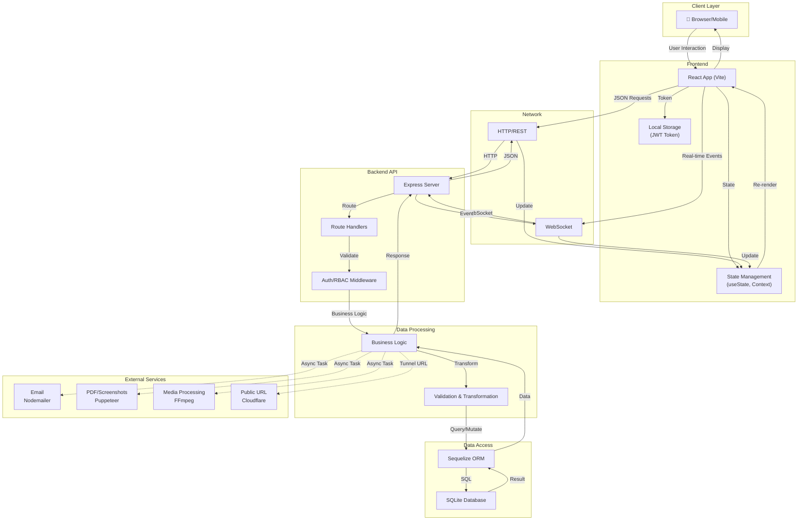

---

## 10. Key Data Flows by Module

| Module | Input | Process | Output | Services |
|--------|-------|---------|--------|----------|
| **Authentication** | Email + Password | Hash verify, JWT generate | Token + User | DB, JWT Library |
| **Quiz Session** | QR/Code + Name | Eligibility check, register | Participant ID | DB, Socket.io |
| **Question Posting** | Question ID | Fetch data, broadcast | All participants see Q | DB, Socket.io |
| **Response Handling** | Answer + Time | Validate, score, store | Score update | DB, Socket.io |
| **Reporting** | Session ID | Query + aggregate + render | PDF/Excel file | DB, Puppeteer, ExcelJS |
| **Email Invite** | User email + meeting info | Template + SMTP send | Email delivered | Nodemailer, SMTP |
| **Certificate** | User + Project | Check completion, generate PDF | PDF + Email sent | DB, Puppeteer, Nodemailer |
| **Offline Sync** | Responses + timestamp | Verify + batch insert | Responses stored | IndexedDB, DB, Network |

---

## Summary

The RetailEdge Pro application operates on a **request-response** and **event-driven** architecture:

1. **User initiates action** in browser
2. **Frontend (React)** collects input, validates locally, sends to backend
3. **Backend (Express)** authenticates, authorizes, validates, processes business logic
4. **Database (SQLite)** stores/retrieves data via Sequelize ORM
5. **External Services** handle async operations (email, PDF, media)
6. **Real-time Events** via Socket.io keep all participants synchronized
7. **Response flows back** to frontend and other connected clients
8. **Frontend re-renders** UI with new data

This architecture supports synchronous REST calls for one-off operations and asynchronous WebSocket events for real-time collaboration (quizzes, live sessions).

